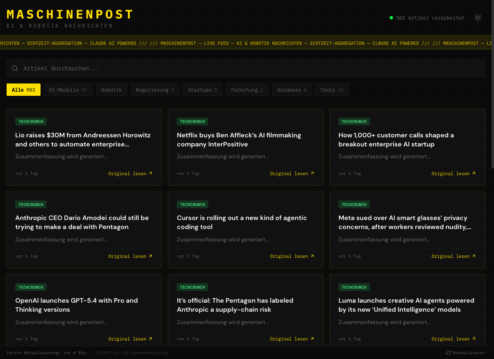
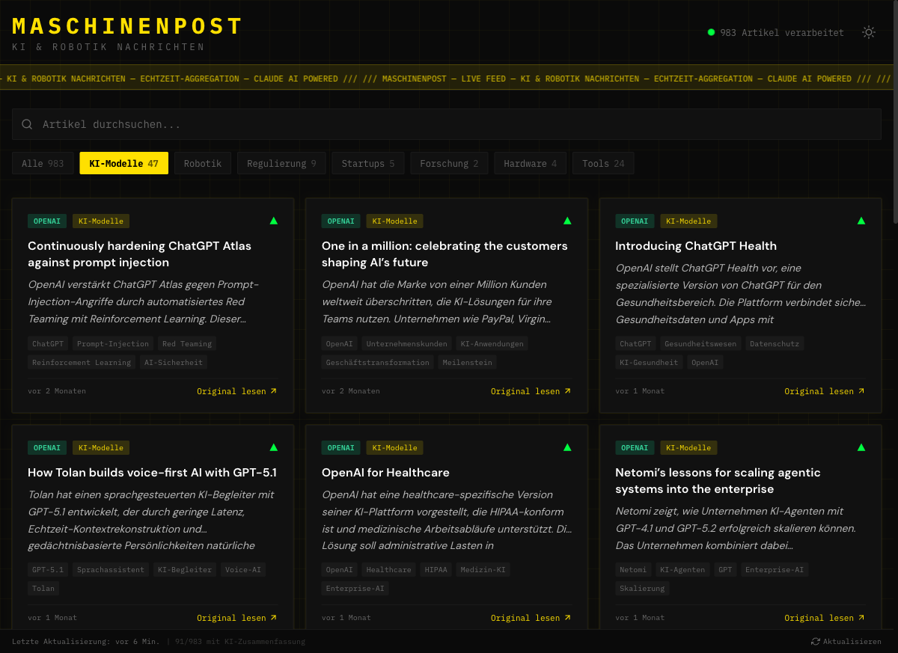

# MaschinenPost

[](https://github.com/pepperonas/maschinen-post/releases)
[](https://opensource.org/licenses/MIT)
[](https://openjdk.org/)
[](https://spring.io/projects/spring-boot)
[](https://react.dev/)
[](https://www.typescriptlang.org/)
[](https://tailwindcss.com/)
[](https://vitejs.dev/)
[](https://docs.anthropic.com/)
[](https://www.sqlite.org/)
[](https://github.com/pepperonas/maschinen-post)
[](https://github.com/pepperonas/maschinen-post/commits/main)
[](https://github.com/pepperonas/maschinen-post)

Dark, industrial-styled AI & Robotics news aggregator with automated RSS feed fetching and Claude-powered German-language summarization.

## Screenshots

### Live Feed — Dark Industrial UI


### AI-Powered Summaries with Category Filtering


## Features

- **RSS Feed Aggregation** — Fetches from 7 AI & Robotics sources every 30 minutes
- **AI Summarization** — Claude Haiku 4.5 generates concise German summaries, tags, categories, and sentiment
- **7 Categories** — KI-Modelle, Robotik, Regulierung, Startups, Forschung, Hardware, Tools
- **Sentiment Analysis** — Visual indicators per article (&#9650; positiv, &#9679; neutral, &#9660; kritisch)
- **Full-Text Search** — Debounced search across titles and AI summaries
- **Live Updates** — 30s polling with "Neue Artikel" notification banner
- **Dark/Light Mode** — Theme toggle persisted in localStorage
- **Industrial Dark UI** — Brutalist design with IBM Plex Mono, grid textures, electric yellow (#FFE000) accents
- **Responsive** — Mobile-first with dense 3-column card grid
- **Cost-Optimized** — Haiku 4.5 model, content truncation, concurrency guards to prevent duplicate API calls

## Architecture

```
maschinen-post/
├── backend/           Spring Boot 3.2 (Java 17)
│   ├── controller/    REST endpoints (Articles, Feeds, Stats)
│   ├── service/       FeedService (RSS), AiSummaryService (Claude), ArticleService
│   ├── scheduler/     FeedScheduler (30-min cycle, concurrency-safe)
│   ├── model/         JPA entities (Article, Feed) + DTOs
│   └── repository/    Spring Data JPA (SQLite)
└── frontend/          React 18 + TypeScript + Vite 5 + Tailwind CSS 3
    ├── components/    Header, ArticleCard, ArticleGrid, CategoryFilter, etc.
    ├── hooks/         useArticles, useStats, useTheme
    └── api/           REST client + TypeScript types
```

### Data Flow

```
FeedScheduler (AtomicBoolean guard)
    ├── @EventListener(ApplicationReadyEvent) ─┐
    ├── @Scheduled(every 30 min) ──────────────┤
    └── POST /api/refresh ─────────────────────┘
            │
            ▼
    runFetchCycle() [single-threaded, guarded]
            │
            ├── FeedService.fetchAllFeeds()
            │       └── Rome RSS Parser → Article entities (SHA-256 dedup)
            │
            └── AiSummaryService.processUnprocessedArticles() [AtomicBoolean guard]
                    └── Per article: re-fetch from DB → Claude API → save summary/tags/category
```

## Tech Stack

| Layer    | Technology                                    |
|----------|-----------------------------------------------|
| Frontend | React 18 + TypeScript 5.5 + Tailwind CSS 3.4 |
| Build    | Vite 5 (frontend) + Maven (backend)           |
| Backend  | Spring Boot 3.2.5 (Java 17)                   |
| AI       | Claude Haiku 4.5 (cost-optimized)             |
| Database | SQLite 3.45 (Hibernate community dialect)     |
| RSS      | Rome 2.1.0 (Java RSS/Atom parser)             |

## RSS Sources

| Source               | Feed URL                                                          |
|----------------------|-------------------------------------------------------------------|
| Google AI Blog       | `feeds.feedburner.com/blogspot/gJZg`                              |
| OpenAI Blog          | `openai.com/blog/rss.xml`                                        |
| The Verge AI         | `theverge.com/rss/ai-artificial-intelligence/index.xml`           |
| TechCrunch AI        | `techcrunch.com/category/artificial-intelligence/feed/`           |
| MIT AI News          | `news.mit.edu/topic/mitartificial-intelligence2-rss.xml`          |
| IEEE Spectrum Robotics | `spectrum.ieee.org/feeds/topic/robotics.rss`                    |
| The Robot Report     | `therobotreport.com/feed/`                                       |

Additional feeds can be added via `POST /api/feeds` at runtime.

## Prerequisites

- Java 17+
- Maven 3.9+
- Node.js 18+
- npm 9+
- Claude API key (optional — app works without it, articles just lack AI summaries)

## Setup

### Backend

```bash
cd backend

# Run without AI summaries
mvn spring-boot:run

# Run with Claude AI summaries
CLAUDE_API_KEY=sk-ant-your-key-here mvn spring-boot:run
```

The backend starts on `http://localhost:8080`. On first launch it:
1. Seeds 7 RSS feed sources into SQLite
2. Fetches all articles from feeds
3. Processes articles with Claude Haiku 4.5 (if API key is set)
4. Repeats the fetch+process cycle every 30 minutes

### Frontend

```bash
cd frontend
npm install
npm run dev
```

The frontend starts on `http://localhost:5173` with automatic API proxy to the backend.

### Production Build

```bash
# Build frontend
cd frontend && npm run build

# Build backend JAR (includes no frontend — deploy separately)
cd backend && mvn clean package -DskipTests

# Run
java -jar target/maschinenpost-0.0.1.jar
```

## API Endpoints

| Method | Path                  | Description                          |
|--------|-----------------------|--------------------------------------|
| GET    | `/api/articles`       | Paginated articles (`page`, `size`, `category`, `search`, `sort`) |
| GET    | `/api/articles/{id}`  | Single article by ID                 |
| GET    | `/api/feeds`          | List all RSS sources                 |
| POST   | `/api/feeds`          | Add new RSS source (`{ name, url }`) |
| GET    | `/api/stats`          | Dashboard stats + category counts    |
| POST   | `/api/refresh`        | Trigger manual feed refresh (concurrency-safe) |

## Configuration

Environment variables:

| Variable         | Default                       | Description                        |
|------------------|-------------------------------|------------------------------------|
| `CLAUDE_API_KEY` | (none)                        | Anthropic API key for AI summaries |
| `SERVER_PORT`    | 8080                          | Backend server port                |

Application config in `backend/src/main/resources/application.yml`:

| Property                                | Default                       | Description                           |
|-----------------------------------------|-------------------------------|---------------------------------------|
| `maschinenpost.claude.model`            | `claude-haiku-4-5-20251001`   | Claude model ID                       |
| `maschinenpost.claude.max-tokens`       | `512`                         | Max response tokens per article       |
| `maschinenpost.scheduler.feed-fetch-rate` | `1800000` (30 min)          | Feed fetch interval in milliseconds   |

## Cost Optimization

The app is designed to minimize Claude API costs:

- **Model:** Haiku 4.5 (~$0.25/MTok input, ~$1.25/MTok output) — 5x cheaper than Sonnet
- **Content truncation:** Article content capped at 2000 characters before sending to Claude
- **Max tokens:** Response limited to 512 tokens (summaries are short)
- **Concurrency guards:** `AtomicBoolean` locks prevent duplicate API calls from concurrent threads
- **DB re-check:** Each article is re-fetched from the database before calling Claude to verify it hasn't already been processed
- **Throttling:** 1000ms delay between consecutive API calls

Estimated cost: ~$0.0003 per article, ~$0.03 for 100 articles.

## License

This project is licensed under the [MIT License](LICENSE).

## Author

**Martin Pfeffer** — [celox.io](https://celox.io) — [GitHub](https://github.com/pepperonas)

---

&copy; 2026 Martin Pfeffer | [celox.io](https://celox.io)
