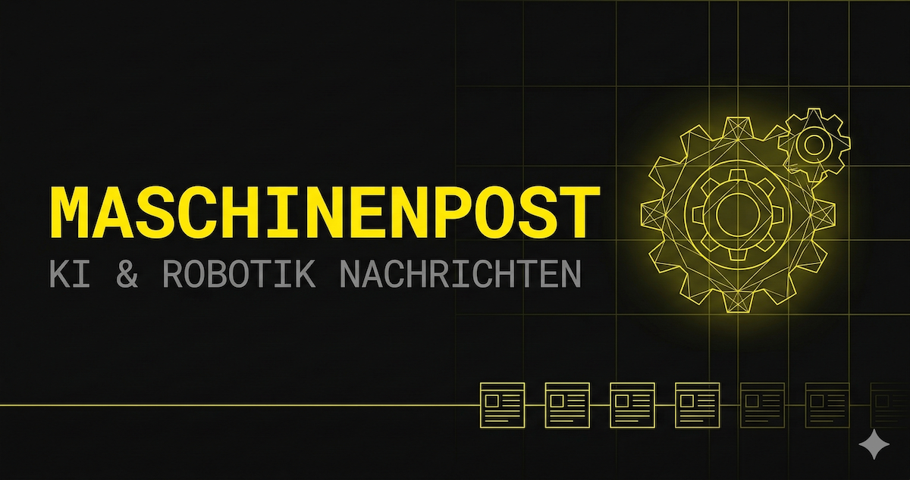

# MaschinenPost



[](https://github.com/pepperonas/maschinen-post/releases)
[](https://opensource.org/licenses/MIT)
[](https://openjdk.org/)
[](https://spring.io/projects/spring-boot)
[](https://react.dev/)
[](https://www.typescriptlang.org/)
[](https://tailwindcss.com/)
[](https://vitejs.dev/)
[](https://docs.anthropic.com/)
[](https://www.postgresql.org/)
[](https://github.com/pepperonas/maschinen-post)
[](https://github.com/pepperonas/maschinen-post/commits/main)
[](https://github.com/pepperonas/maschinen-post)

Echtzeit-Nachrichtenaggregator für Künstliche Intelligenz und Robotik mit automatischer RSS-Aggregation und Claude-gestützter Zusammenfassung auf Deutsch.

**Live:** [maschinenpost.celox.io](https://maschinenpost.celox.io)

## Screenshots

### Live Feed — Dark Industrial UI


### AI-Powered Summaries with Category Filtering


## Features

- **10 RSS-Quellen** — 7 englische + 3 deutsche Feeds, automatisch alle 3 Stunden aktualisiert
- **KI-Zusammenfassungen** — Claude Haiku 4.5 generiert deutsche Zusammenfassungen, Tags, Kategorien und Sentiment
- **7 Kategorien** — KI-Modelle, Robotik, Regulierung, Startups, Forschung, Hardware, Tools
- **Sentimentanalyse** — Visuelle Indikatoren pro Artikel (&#9650; positiv, &#9679; neutral, &#9660; kritisch)
- **Volltextsuche** — Debounced-Suche über Titel und KI-Zusammenfassungen
- **Live-Updates** — 30s-Polling mit "Neue Artikel"-Banner
- **Dark/Light Mode** — Theme-Wechsel in localStorage persistiert
- **Industrial Dark UI** — Brutalist-Design mit IBM Plex Mono, Grid-Texturen, Electric Yellow (#FFE000) Akzenten
- **Responsive** — Mobile-first mit 3-Spalten-Kartenraster
- **Sprachanzeige** — Quellen und Sprache (EN/DE) auf jeder Karte sichtbar
- **Rechtskonforme Seiten** — Impressum, Datenschutzerklärung, Nutzungsbedingungen
- **Kostenoptimiert** — Haiku 4.5, Content-Truncation, Concurrency-Guards gegen doppelte API-Calls

## Architektur

```
maschinen-post/
├── backend/           Spring Boot 3.2 (Java 17)
│   ├── controller/    REST-Endpoints (Articles, Feeds, Stats)
│   ├── service/       FeedService (RSS), AiSummaryService (Claude), ArticleService
│   ├── scheduler/     FeedScheduler (3-Stunden-Zyklus, Concurrency-sicher)
│   ├── model/         JPA-Entities (Article, Feed) + DTOs
│   └── repository/    Spring Data JPA (SQLite dev / PostgreSQL prod)
├── frontend/          React 18 + TypeScript + Vite 5 + Tailwind CSS 3
│   ├── components/    Header, ArticleCard, ArticleGrid, CategoryFilter, Footer, etc.
│   ├── pages/         Impressum, Datenschutz, AGB (Hash-Routing)
│   ├── hooks/         useArticles, useStats, useTheme
│   └── api/           REST-Client + TypeScript-Types
└── scripts/
    └── deploy.sh      rsync-basiertes Deployment auf VPS
```

### Datenfluss

```
FeedScheduler (AtomicBoolean Guard)
    ├── @EventListener(ApplicationReadyEvent) ─┐
    ├── @Scheduled(alle 3 Stunden) ────────────┤
    └── POST /api/refresh ─────────────────────┘
            │
            ▼
    runFetchCycle() [single-threaded, guarded]
            │
            ├── FeedService.fetchAllFeeds()
            │       └── Rome RSS Parser → Article-Entities (SHA-256 Dedup)
            │           └── feed.language → article.language
            │
            └── AiSummaryService.processUnprocessedArticles() [AtomicBoolean Guard]
                    └── Pro Artikel: DB re-fetch → Claude API → Summary/Tags/Kategorie speichern
```

## Tech Stack

| Schicht  | Technologie                                   |
|----------|-----------------------------------------------|
| Frontend | React 18 + TypeScript 5.5 + Tailwind CSS 3.4 |
| Build    | Vite 5 (Frontend) + Maven (Backend)           |
| Backend  | Spring Boot 3.2.5 (Java 17)                  |
| KI       | Claude Haiku 4.5 (kostenoptimiert)            |
| Datenbank | SQLite 3.45 (dev) / PostgreSQL 16 (prod)     |
| RSS      | Rome 2.1.0 (Java RSS/Atom Parser)             |
| Deploy   | rsync + systemd + Nginx + Let's Encrypt       |

## RSS-Quellen

| Quelle               | Sprache | Feed URL                                                          |
|----------------------|---------|-------------------------------------------------------------------|
| Google AI Blog       | EN      | `feeds.feedburner.com/blogspot/gJZg`                              |
| OpenAI Blog          | EN      | `openai.com/blog/rss.xml`                                        |
| The Verge AI         | EN      | `theverge.com/rss/ai-artificial-intelligence/index.xml`           |
| TechCrunch AI        | EN      | `techcrunch.com/category/artificial-intelligence/feed/`           |
| MIT AI News          | EN      | `news.mit.edu/topic/mitartificial-intelligence2-rss.xml`          |
| IEEE Spectrum Robotics | EN    | `spectrum.ieee.org/feeds/topic/robotics.rss`                      |
| The Robot Report     | EN      | `therobotreport.com/feed/`                                       |
| heise online         | DE      | `heise.de/rss/heise-atom.xml`                                    |
| Golem.de             | DE      | `rss.golem.de/rss.php?feed=RSS2.0`                               |
| t3n                  | DE      | `t3n.de/rss.xml`                                                 |

Weitere Feeds können zur Laufzeit via `POST /api/feeds` hinzugefügt werden.

## Voraussetzungen

- Java 17+
- Maven 3.9+
- Node.js 18+
- npm 9+
- Claude API Key (optional — App funktioniert ohne, Artikel haben dann keine KI-Zusammenfassungen)

## Setup

### Backend

```bash
cd backend

# Ohne KI-Zusammenfassungen
mvn spring-boot:run

# Mit Claude-KI-Zusammenfassungen
CLAUDE_API_KEY=sk-ant-your-key-here mvn spring-boot:run
```

Das Backend startet auf `http://localhost:8080`. Beim ersten Start:
1. 10 RSS-Feed-Quellen in SQLite angelegt
2. Alle Artikel aus den Feeds abgerufen
3. Artikel mit Claude Haiku 4.5 verarbeitet (falls API Key gesetzt)
4. Fetch+Process-Zyklus alle 3 Stunden wiederholt

### Frontend

```bash
cd frontend
npm install
npm run dev
```

Das Frontend startet auf `http://localhost:5173` mit automatischem API-Proxy zum Backend.

### Produktion

```bash
# Frontend + Backend bauen und auf VPS deployen
bash scripts/deploy.sh
```

Das Deploy-Script baut Frontend und Backend-JAR, kopiert beides via rsync/scp auf den VPS und startet den systemd-Service neu.

#### Manuelle Produktion (ohne Deploy-Script)

```bash
# Frontend bauen
cd frontend && npm run build

# Backend-JAR bauen
cd backend && mvn clean package -DskipTests

# Starten (mit prod-Profil für PostgreSQL)
java -jar -Dspring.profiles.active=prod target/maschinenpost-1.0.0.jar
```

## API Endpoints

| Methode | Pfad                  | Beschreibung                          |
|---------|-----------------------|---------------------------------------|
| GET     | `/api/articles`       | Paginierte Artikel (`page`, `size`, `category`, `search`, `sort`) |
| GET     | `/api/articles/{id}`  | Einzelner Artikel nach ID             |
| GET     | `/api/feeds`          | Alle RSS-Quellen auflisten            |
| POST    | `/api/feeds`          | Neue RSS-Quelle hinzufügen (`{ name, url }`) |
| GET     | `/api/stats`          | Dashboard-Statistiken + Kategoriezähler |
| POST    | `/api/refresh`        | Manuellen Feed-Refresh auslösen (Concurrency-sicher) |

## Konfiguration

Umgebungsvariablen:

| Variable         | Standard                      | Beschreibung                       |
|------------------|-------------------------------|------------------------------------|
| `CLAUDE_API_KEY` | (keiner)                      | Anthropic API Key für KI-Zusammenfassungen |
| `SERVER_PORT`    | 8080 (dev) / 3010 (prod)     | Backend-Server-Port                |
| `DB_USERNAME`    | —                             | PostgreSQL-Benutzername (nur prod) |
| `DB_PASSWORD`    | —                             | PostgreSQL-Passwort (nur prod)     |

Anwendungskonfiguration in `backend/src/main/resources/application.yml`:

| Property                                  | Standard                      | Beschreibung                          |
|-------------------------------------------|-------------------------------|---------------------------------------|
| `maschinenpost.claude.model`              | `claude-haiku-4-5-20251001`   | Claude-Modell-ID                      |
| `maschinenpost.claude.max-tokens`         | `512`                         | Max. Antwort-Tokens pro Artikel       |
| `maschinenpost.scheduler.feed-fetch-rate` | `10800000` (3 Std.)           | Feed-Abrufintervall in Millisekunden  |

## Kostenoptimierung

Die App minimiert Claude-API-Kosten:

- **Modell:** Haiku 4.5 (~$0.25/MTok Input, ~$1.25/MTok Output) — 5x günstiger als Sonnet
- **Content-Truncation:** Artikelinhalt auf 2000 Zeichen begrenzt
- **Max Tokens:** Antwort auf 512 Tokens limitiert (Zusammenfassungen sind kurz)
- **Concurrency Guards:** `AtomicBoolean`-Locks verhindern doppelte API-Calls durch parallele Threads
- **DB-Recheck:** Jeder Artikel wird vor dem Claude-API-Call erneut aus der DB geladen, um doppelte Verarbeitung zu verhindern
- **Throttling:** 1000ms Pause zwischen aufeinanderfolgenden API-Calls

Geschätzte Kosten: ~$0.0003 pro Artikel, ~$0.03 für 100 Artikel.

## Lizenz

Dieses Projekt steht unter der [MIT-Lizenz](LICENSE).

## Autor

**Martin Pfeffer** — [celox.io](https://celox.io) — [GitHub](https://github.com/pepperonas)

---

&copy; 2026 Martin Pfeffer | [celox.io](https://celox.io)
